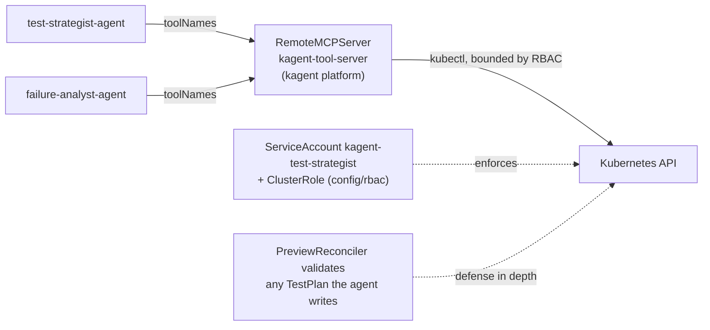

# MCP Servers & Agent Tools

> How the kagent agents read and write the cluster — the MCP tool servers they use, what each agent is granted, and how to extend it.

## Introduction
The operator's AI agents don't talk to the Kubernetes API directly — they call
**tools** exposed over the Model Context Protocol (MCP). An MCP "tool server"
publishes named tools (e.g. `k8s_get_pod_logs`); an Agent CR lists the exact tool
names it may call. This guide covers the MCP servers shipped in this repo, the
platform server the agents actually call, and how to grant an agent more.

## What it's for
Agents need *scoped, auditable* access to cluster state: the test‑strategist must
read the diff and write a `TestPlan`; the failure‑analyst must read logs and events
but never secrets. MCP makes that grant explicit and per‑tool, so a compromised or
hallucinating agent can only do what its tool list — and the underlying RBAC —
allow. See [Security & Isolation](./security.md) for the blast‑radius argument.

## What it does
- Defines two **scoped MCPServer policy CRs** in this repo describing the Kubernetes access the agents are meant to have (read CRs; write TestPlans only).
- Wires each Agent CR to a tool server via `spec.declarative.tools[].mcpServer`, selecting an explicit `toolNames` allow‑list.
- Backs the whole thing with a bounded ServiceAccount + ClusterRole, plus controller‑side validation of anything an agent writes.

## How it works



An agent's model decides to call a tool by name; the MCP server executes it as a
bounded `kubectl`‑style call against the API. Two independent limits apply: the
agent's **ServiceAccount RBAC** (what the API server will allow) and, for writes,
the **controller's validation** of the resulting `TestPlan`
(see [AI Test Strategist](./ai-test-strategist.md)). The tool allow‑list in the
Agent CR is the narrowest of the three.

## What ships in this repo vs. the kagent platform
Being explicit here matters — half of this lives outside the repo.

**In this repo** (`k8s/kagent/`):
- Two scoped policy CRs (`kind: MCPServer`, `kagent.dev/v1alpha1`):
  - [`kube-read-mcp.yaml`](../../k8s/kagent/mcp-servers/kube-read-mcp.yaml) — read‑only `get/list/watch` on `previews`, `testplans`, `reconcileevents` (group `platform.company.io`), stdio transport `kubectl get`.
  - [`kube-write-testplan-mcp.yaml`](../../k8s/kagent/mcp-servers/kube-write-testplan-mcp.yaml) — `create/update/patch` on `testplans` and `testplans/status` **only**, stdio transport `kubectl apply`.
- Two Agent CRs: [`test-strategist-agent.yaml`](../../k8s/kagent/agents/test-strategist-agent.yaml), [`failure-analyst-agent.yaml`](../../k8s/kagent/agents/failure-analyst-agent.yaml).
- The agent RBAC: [`config/rbac/agent_role.yaml`](../../config/rbac/agent_role.yaml), [`agent_rolebinding.yaml`](../../config/rbac/agent_rolebinding.yaml) (ServiceAccount `kagent-test-strategist`).

**Provided by the kagent platform** (installed at README Installation → "Install kagent"):
- The `RemoteMCPServer` named **`kagent-tool-server`** that the agents actually reference — and the implementations of the `k8s_*` tools.
- The `ModelConfig` (LLM endpoint/key) and the `preview-diff-analyzer` / `preview-troubleshooter` agents (deployed from the app repo).

> So the agents in this repo point their `mcpServer.name` at the platform's
> `kagent-tool-server`. The two in‑repo `MCPServer` CRs document/define the intended
> Kubernetes scope; the durable security boundary is RBAC + controller validation.

## Which tools each agent gets
The allow‑list is `spec.declarative.tools[].mcpServer.toolNames` in each Agent CR:

| Agent | toolNames | Effect |
|-------|-----------|--------|
| test‑strategist | `k8s_get_resources`, `k8s_describe_resource`, `k8s_get_resource_yaml`, `k8s_apply_manifest`, `k8s_patch_resource` | read context + **write the TestPlan** |
| failure‑analyst | `k8s_get_pod_logs`, `k8s_get_resources`, `k8s_get_events`, `k8s_describe_resource`, `k8s_get_resource_yaml` | read‑only diagnosis (no write, no secrets) |

## How to grant an agent a new tool
1. Add the tool name to the agent's `toolNames` list and `kubectl apply` the Agent CR:
   ```yaml
   # k8s/kagent/agents/failure-analyst-agent.yaml
   tools:
   - type: McpServer
     mcpServer:
       apiGroup: kagent.dev
       kind: RemoteMCPServer
       name: kagent-tool-server
       toolNames:
         - k8s_get_pod_logs
         - k8s_get_events
         - k8s_get_resources
         - k8s_describe_resource
         - k8s_get_resource_yaml
         - <new_tool_name>          # ← add a tool the server already exposes
   ```
2. The tool **must already be provided** by `kagent-tool-server` — you can only
   allow‑list tools the platform server exposes.
3. If the new tool writes or reads something new, widen the agent's RBAC in
   `config/rbac/agent_role.yaml` accordingly — otherwise the call is denied at the
   API server even though the tool is allow‑listed.
4. Update the agent's `systemMessage` so it knows when to use the tool (see
   [Customizing AI Prompts](./ai-prompts.md)).

To add a *new* MCP server (e.g. a Postgres‑query tool), define a new `MCPServer` /
`RemoteMCPServer` it can reach and reference it as another entry under `tools`.

## Relationships with other components
- [AI Test Strategist](./ai-test-strategist.md) / [AI Failure Analysis](./ai-failure-analysis.md) — the agents that consume these tools.
- [Customizing AI Prompts](./ai-prompts.md) — the `systemMessage` that tells an agent how to use its tools.
- [Security & Isolation](./security.md) and [../rbac-design.md](../rbac-design.md) — the RBAC boundary and bounded‑blast‑radius design.

## Configuration
| Item | Where | Notes |
|------|-------|-------|
| Tool allow‑list | Agent CR `spec.declarative.tools[].mcpServer.toolNames` | Narrowest grant; edit + `kubectl apply` |
| Scoped K8s policy CRs | `k8s/kagent/mcp-servers/*.yaml` | `kind: MCPServer`, `kagent.dev/v1alpha1`, namespace `kagent-system` |
| Tool server | `kagent-tool-server` (RemoteMCPServer) | Provided by the kagent platform, not this repo |
| Agent RBAC | `config/rbac/agent_role.yaml` / `agent_rolebinding.yaml` | SA `kagent-test-strategist` |
| kagent version | install | **0.9.2 required** (0.9.4 broke A2A sessions); all agents live in `kagent-system` |

## Reference
- Scoped policy CRs: [`../../k8s/kagent/mcp-servers/`](../../k8s/kagent/mcp-servers/)
- Agent tool wiring: [`../../k8s/kagent/agents/test-strategist-agent.yaml`](../../k8s/kagent/agents/test-strategist-agent.yaml), [`../../k8s/kagent/agents/failure-analyst-agent.yaml`](../../k8s/kagent/agents/failure-analyst-agent.yaml)
- Agent RBAC: [`../../config/rbac/agent_role.yaml`](../../config/rbac/agent_role.yaml), [`../../config/rbac/agent_rolebinding.yaml`](../../config/rbac/agent_rolebinding.yaml)
- Install steps & kagent 0.9.2 requirement: [`../../README.md`](../../README.md) (Installation → "Install kagent")
