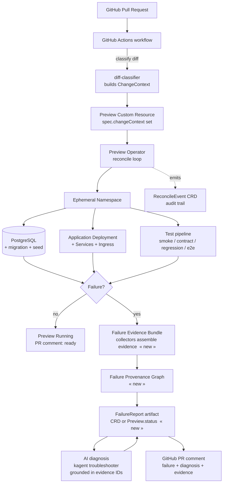
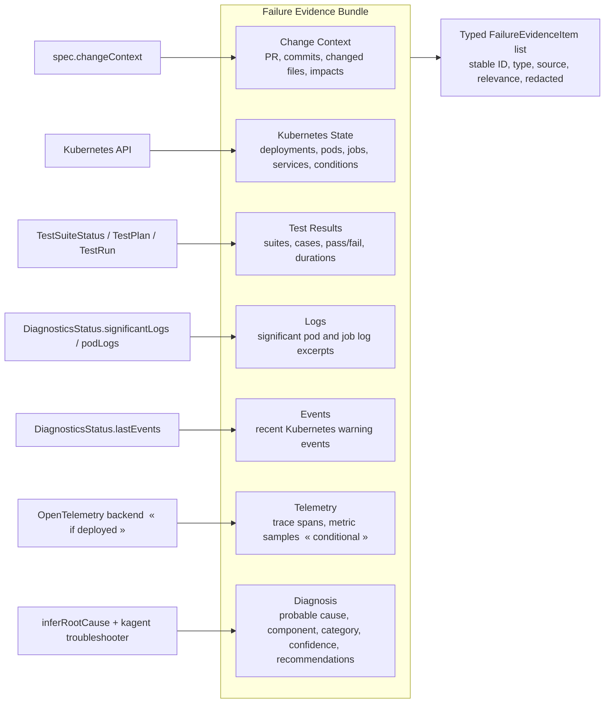
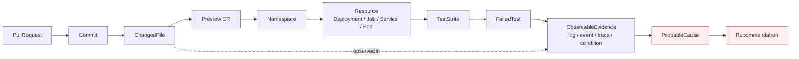

# Architecture

This chapter documents the architecture of operator-captured failure provenance using
Mermaid diagrams. The diagrams render on GitHub and in most Markdown viewers, and can
be exported (e.g. via `mermaid-cli`) to vector figures for the article.

The diagrams are grounded in the actual `preview-operator` implementation: the
`Preview` CRD and its phases (`Pending`, `Provisioning`, `Running`, `Terminating`,
`Failed`, `AwaitingTestPlan`), the finalizer `platform.company.io/finalizer`, the
`ChangeContextSpec`, the `DiagnosticsStatus`, the `ReconcileEvent` / `TestPlan` /
`TestRun` CRDs, and the three kagent agents (diff-analyzer, troubleshooter,
test-strategist). New components introduced by this article are marked **(new)**.

---

## Diagram 1 — End-to-end flow

From a pull request to a failure report posted back on the PR.



Key point: the **Failure Evidence Bundle**, the **Failure Provenance Graph**, and the
**FailureReport** are produced inside the operator's reconcile loop, on the failure
path, before namespace teardown.

---

## Diagram 2 — Failure Evidence Bundle composition

What the bundle aggregates, and the source of each part.



`Telemetry` is **conditional**: trace and metric evidence require app-level
OpenTelemetry instrumentation and an external backend. When absent, the bundle records
telemetry as *not available* rather than empty — see `methodology.md` §2.

---

## Diagram 3 — Failure Provenance Graph

The provenance chain linking a change to a diagnosis. Mapped to W3C PROV in
`failure-evidence-model.md`.



Every `ProbableCause` node must connect to at least one `ObservableEvidence` node: this
is the **grounding constraint** that RQ4 evaluates. A cause with no evidence edge is, by
construction, ungrounded.

---

## Diagram 4 — Evidence persistence before namespace deletion

How the finalizer sequences evidence persistence ahead of teardown. This is the
mechanism behind RQ1.

```mermaid
sequenceDiagram
    participant K as Kubernetes API
    participant O as Preview Operator
    participant N as Ephemeral Namespace
    participant S as FailureReport store<br/>(cluster-scoped CR / external)

    Note over O,N: Preview running; a failure is detected
    O->>O: detect failure (test/job/pod)
    O->>N: collect evidence (logs, events, resource state)
    O->>O: assemble Failure Evidence Bundle + Provenance Graph
    O->>S: persist FailureReport artifact
    O->>O: produce grounded AI diagnosis, attach to artifact

    Note over K,N: deletion requested (TTL expiry or Preview deleted)
    K->>O: Preview has deletionTimestamp + finalizer
    O->>S: verify FailureReport persisted (idempotent)
    alt artifact persisted
        O->>N: delete namespace and child resources
        O->>K: remove finalizer
        K->>K: Preview object garbage-collected
    else artifact not yet persisted
        O->>S: persist now, then proceed
    end
    Note over S: evidence survives namespace teardown
```

The finalizer (`platform.company.io/finalizer`, already present in the operator)
guarantees the operator runs *before* the object is removed. The article's change is to
make evidence persistence an explicit, verified pre-condition of teardown.

---

## Component responsibilities

| Component | New? | Responsibility |
|-----------|------|----------------|
| diff-classifier (GitHub Actions) | existing | Builds `spec.changeContext` from the PR diff |
| Preview controller / reconcile loop | existing | Drives the environment through its phases |
| `DiagnosticsStatus` collector (`diagnostics.go`) | existing | Significant logs, events, pod logs, rule-based root cause |
| kagent agents (diff-analyzer, troubleshooter, test-strategist) | existing | AI diff analysis, AI troubleshooting, AI test selection |
| `ReconcileEvent` / `TestPlan` / `TestRun` CRDs | existing | Reconcile audit trail; test selection and results |
| Evidence collectors | **new** | Turn existing signals into typed `FailureEvidenceItem`s |
| Bundle assembler | **new** | Build the `FailureEvidenceBundle` |
| Provenance graph builder | **new** | Link evidence into the provenance graph |
| Redaction utility | **new** | Strip secrets/tokens from evidence before persistence |
| `FailureReport` artifact | **new** | Persist the bundle + graph + diagnosis (Phase 3) |
| Grounding check | **new** | Enforce that each diagnosis claim cites an existing evidence ID |

The **new** components reuse the existing signals rather than re-collecting them: the
contribution is structure, linkage, grounding, and persistence — not new data sources.

---

## Rendering the diagrams as figures

```bash
# Requires: npm i -g @mermaid-js/mermaid-cli
mmdc -i architecture.md -o /tmp/diagram.svg   # or extract each block to its own .mmd
```

For the article, export each diagram to PDF/SVG and place it per the figure table in
`article-outline.md` (Fig. 1–4).
