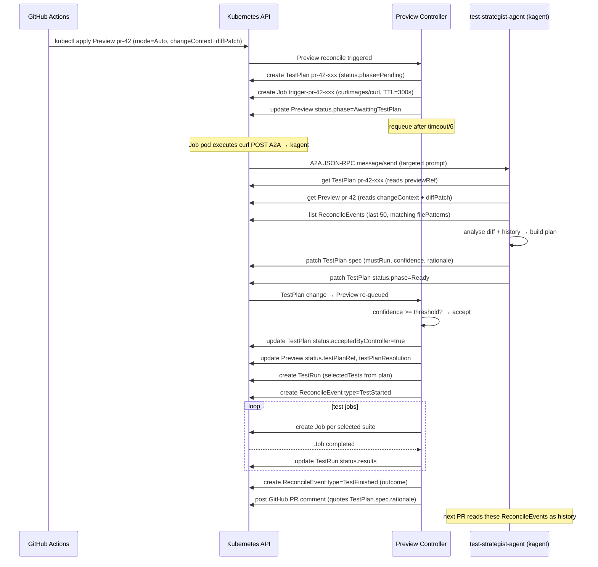

# AI Test Strategist — Architecture and Flow

## Overview

The Preview operator integrates a kagent-based AI agent that decides **which tests
to run for each pull request**. The agent and the controller communicate exclusively
through Kubernetes Custom Resources — no HTTP calls, no shared memory, no direct API
coupling. Kubernetes is the bus.

> **Core principle: "AI as just another controller."**
> The agent reads CRDs, writes CRDs. The controller reads CRDs, creates workloads.
> Neither knows the other exists at the code level.

---

## The CRD bus

```
Preview (existing, extended)
  spec.testStrategy.mode: Auto | Manual | FullSuite
  spec.testStrategy.confidenceThreshold: 70
  spec.testStrategy.agentTimeoutSeconds: 60
  spec.testStrategy.fallbackOnAgentTimeout: Full | Skip | Error
  spec.changeContext.changedFiles[].path / .type
  spec.changeContext.detectedImpacts
  spec.changeContext.diffPatch          ← raw unified diff (max 64 KiB)
  status.testPlanRef: ObjectReference
  status.testPlanResolution: {source, resolvedAt, rationale}

TestPlan (new — agent writes, controller reads)
  spec.previewRef
  spec.confidence: 0-100
  spec.mustRun, spec.shouldRun, spec.canSkip: []TestSelector
  spec.rationale: string
  status.phase: Pending | Ready | Stale | Rejected
  status.acceptedByController: bool

TestRun (new — controller writes, audit record)
  spec.previewRef, spec.testPlanRef
  spec.selectedTests: []TestSelector
  status.phase: Pending | Running | Succeeded | Failed

ReconcileEvent (new — controller writes, agent reads as history)
  spec.previewRef, spec.type, spec.testSuite, spec.outcome
  spec.filePatterns: []string   (denormalized for fast queries)
  spec.occurredAt: timestamp
```

Inspect the full state of any PR:
```bash
kubectl get preview pr-42
kubectl get testplan,testrun,reconcileevent -n preview-pr-42
```

---

## Sequence diagram



---

## Reconcile loop — controller side

On every reconcile of a Preview with `spec.testSuite.enabled=true`:

1. **FullSuite mode** (or no `spec.testStrategy`): controller generates a `TestPlan`
   internally (generatedBy: FallbackPolicy) and runs all enabled suites. Backward compatible.

2. **Manual mode**: controller reads `spec.testStrategy.manualPlanRef`. If the plan is
   present and not Stale, uses it. Otherwise falls back to FullSuite.

3. **Auto mode, no TestPlan yet**:
   - Controller creates a stub `TestPlan` (phase=Pending) with labels
     `platform.company.io/preview-name: pr-42`.
   - Controller creates an ephemeral Kubernetes Job (`trigger-<planName>`) with
     `curlimages/curl` that sends one A2A JSON-RPC call to the test-strategist
     agent. The Job is auto-deleted 5 minutes after completion. No CronJob, no polling.
   - Sets `status.phase = AwaitingTestPlan`.
   - Requeues after `agentTimeoutSeconds / 6`.

4. **Auto mode, TestPlan phase=Pending**:
   - Still waiting. If `creationTimestamp + agentTimeoutSeconds` has passed →
     apply `fallbackOnAgentTimeout` policy (Full / Skip / Error).

5. **Auto mode, TestPlan phase=Ready**:
   - Validate: `mustRun ∩ canSkip == ∅`. If not → reject (phase=Rejected), fallback.
   - Check confidence: `plan.spec.confidence >= confidenceThreshold`. If not → reject, fallback.
   - Accept: `status.acceptedByController=true`.
   - Structured log: `previewName=pr-42 decisionSource=agent confidence=87 correlationID=pr-42-a1b2`

6. **Create TestRun**: records the selected tests. Launches Jobs per selected suite.

7. **Emit ReconcileEvents**: `TestStarted` + `TestFinished` with outcome. These become
   the history the agent reads for future PRs.

8. **Commit SHA change**: any TestPlan whose `spec.commitSHA` differs from
   `spec.changeContext.diffRef.headSHA` is marked `phase=Stale`. The cycle restarts.

---

## Worked example (demoshop PR #42)

**PR**: adds a database migration + updates `api/openapi.yaml`.
**changeContext.detectedImpacts**: `database=true, apiContract=true, backend=true`.

### Step 1 — Preview created

```yaml
apiVersion: platform.company.io/v1alpha1
kind: Preview
metadata:
  name: pr-42
spec:
  branch: feature/payments
  prNumber: 42
  image: ghcr.io/ihsenalaya/idp-preview:sha-abc123
  testStrategy:
    mode: Auto
    confidenceThreshold: 70
  changeContext:
    diffRef:
      headSHA: abc123
    changedFiles:
      - path: db/migrations/20260510_add_orders.sql
        type: database-migration
      - path: api/openapi.yaml
        type: api-contract
      - path: src/orders/service.py
        type: backend
    detectedImpacts:
      database: true
      apiContract: true
      backend: true
status:
  phase: AwaitingTestPlan
```

### Step 2 — Controller creates stub TestPlan

```yaml
apiVersion: platform.company.io/v1alpha1
kind: TestPlan
metadata:
  name: pr-42-f3a8b1
  namespace: preview-pr-42
  labels:
    platform.company.io/preview-name: pr-42
    platform.company.io/commit-sha: abc123
  annotations:
    idp-preview.io/requested-by: pr-42
spec:
  previewRef:
    name: pr-42
  commitSHA: abc123
status:
  phase: Pending
```

### Step 3 — Agent fills the TestPlan

```yaml
spec:
  generatedBy: Agent
  agentName: test-strategist-agent
  confidence: 91
  mustRun:
    - suite: smoke
      name: "*"
      reason: "always run"
    - suite: migration
      name: "*"
      reason: "db/migrations/20260510_add_orders.sql changed — migration suite is mandatory"
    - suite: contract
      name: "*"
      reason: "api/openapi.yaml changed — contract suite is mandatory"
  shouldRun:
    - suite: regression
      name: "*"
      reason: "backend service changed; regression recommended"
  canSkip:
    - suite: e2e
      name: "*"
      reason: "no frontend changes; e2e is expensive and low-value for this diff"
  rationale: |
    Database migration and OpenAPI spec both changed, making migration and
    contract suites mandatory. Backend service change warrants regression.
    No frontend changes so e2e is safely skipped. Historical data shows
    3/5 recent migration PRs had migration failures, confirming high priority.
  estimatedDurationSeconds: 240
status:
  phase: Ready
```

### Step 4 — Controller accepts and creates TestRun

```yaml
apiVersion: platform.company.io/v1alpha1
kind: TestRun
metadata:
  name: pr-42-run-x9k2
  namespace: preview-pr-42
spec:
  previewRef:
    name: pr-42
  testPlanRef:
    name: pr-42-f3a8b1
    namespace: preview-pr-42
  selectedTests:
    - suite: smoke, name: "*"
    - suite: migration, name: "*"
    - suite: contract, name: "*"
    - suite: regression, name: "*"
status:
  phase: Running
```

### Step 5 — ReconcileEvents written

```bash
kubectl get reconcileevent -n preview-pr-42
NAME                          TYPE           SUITE       OUTCOME
pr-42-TestStarted-m8n2        TestStarted    ""          ""
pr-42-TestFinished-p3q7       TestFinished   ""          Succeeded
```

### Step 6 — PR comment (from `status.testPlanResolution.rationale`)

> **Tests selected by AI strategist** (confidence: 91%)
>
> Database migration and OpenAPI spec both changed, making migration and
> contract suites mandatory. Backend service change warrants regression.
> No frontend changes so e2e is safely skipped...
>
> *Suites run: smoke ✓ migration ✓ contract ✓ regression ✓*
> *Suites skipped: e2e (safe to skip — no frontend changes)*

---

## RBAC design — bounded blast radius

Two ServiceAccounts. Two ClusterRoles.

**`idp-preview-controller`** (manager-role): full reconcile permissions on all new CRDs
plus existing workload perms.

**`kagent-test-strategist`**: scoped to:
- `get/list/watch` on previews, testplans, reconcileevents
- `create/update/patch` on testplans, testplans/status
- **Nothing else** — no deployments, no pods, no secrets, no testruns

The key property for security review:
> An attacker who compromises the agent binary can at worst write a malicious TestPlan.
> The controller will discard it if confidence is below threshold (default 70), or fall
> back to FullSuite if the plan is structurally invalid (mustRun ∩ canSkip non-empty).
> **Blast radius is bounded by the controller's policy, not by the agent's good behavior.**

Verify the boundary:
```bash
kubectl auth can-i create deployments \
  --as=system:serviceaccount:kagent-system:kagent-test-strategist
# → no
kubectl auth can-i create testplans.platform.company.io \
  --as=system:serviceaccount:kagent-system:kagent-test-strategist
# → yes
```

---

## Failure modes and resilience

| Scenario | Outcome |
|---|---|
| Trigger Job pod fails to start | No TestPlan filled → controller falls back to FullSuite after timeout |
| kagent Deployment not running | Trigger Job exits with error → TestPlan stays Pending → fallback after timeout |
| Agent confidence < threshold | Plan rejected → controller falls back to FullSuite |
| Agent writes invalid plan (mustRun ∩ canSkip) | Plan rejected → controller falls back to FullSuite |
| Commit SHA changes mid-flight | TestPlan marked Stale → controller creates new stub + new trigger Job → agent fills new plan |
| `fallbackOnAgentTimeout: Skip` | Tests skipped entirely; ReconcileEvent written with outcome=Skipped |
| `fallbackOnAgentTimeout: Error` | Preview phase=Failed; surfaced in PR comment |

The controller never blocks on kagent. kagent is enhancement, not dependency.

Debug trigger Job failures:
```bash
kubectl get jobs -n preview-pr-42 | grep trigger
kubectl logs -n preview-pr-42 job/trigger-pr-42-xxxxx
```

---

## Adding a new agent

Every future agent (recovery, exploratory tester, load tester) plugs into the same bus:

1. Define its input and output CRDs (or reuse existing ones).
2. Create its ServiceAccount with scoped RBAC (no workload access).
3. Write its kagent Agent CR with the appropriate MCP servers.
4. The controller reads its output CRDs and acts on them — no LLM code in the controller.

See [agent-contract.md](agent-contract.md) for the agent-facing API contract.
See [rbac-design.md](rbac-design.md) for the security argument in detail.
